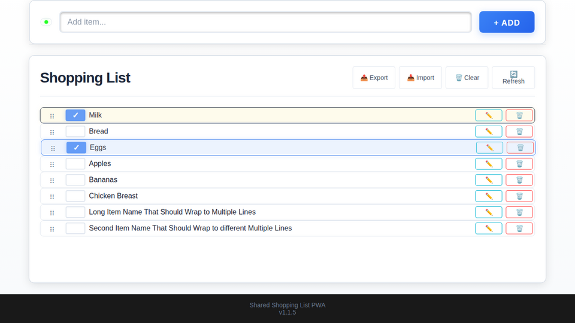
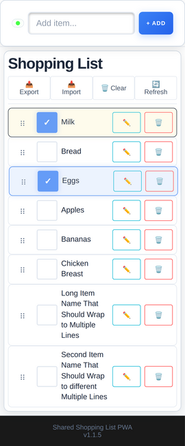

# Shared list
Vibe coded shared grocery list, no users or authentication just a shared list anyone with a link can edit.

## Screenshots




## Overview

* Dependencies: python `uv` or `docker`.
* Backend: FastApi `app/main.py`, see http://0.0.0.0:8000/docs if running locally on port 8000.
* Storage: Sqlite `app/database.py`, saved to `app/data/data_<PORT>.db`
* Frontend layout: `app/template/index.html` and `app/styles.css`
* Progressive Web App (PWA) for iOS "Add to Home Screen"
* Frontend code: Vanilla single page JavaScript, `app/app.js`
* Real time Synchronization using Server-Sent Events (SSE) to instantly sync events for all connected devices.
* Import/export: Flexible simple clipboard import export
* Add/edit/toggle/re-arrange individual items optimized for both mobile and desktop
* Testing: unittesting for docker and backend api and playwright for frontend with desktop and iOS targets.

## Development

Git clone (or [download](https://github.com/obtitus/shared-list/archive/refs/heads/main.zip) this repo)
```
git clone https://github.com/obtitus/shared-list.git
cd shared-list
```

To test locally, run either (assume [uv](https://docs.astral.sh/uv/) is installed)
```
make run
```
or (assumes [docker](https://www.docker.com/) is setup)
```
make docker-run
```

## Deploy my version

Either clone this repo and run with `uv`, see below, or use the pre-built docker image by
creating a `docker-compose.yml` file:
```yml
services:
  shared-list:
    image: ghcr.io/obtitus/shared-list:latest
    environment:
      - HOST=0.0.0.0
      - PORT=8000
      - PYTHONPATH=/code
      - UV_NO_DEV=1
    restart: unless-stopped
    healthcheck:
      test: ["CMD", "curl", "-f", "http://localhost:${PORT:-8000}/"]
      interval: 30s
      timeout: 10s
      retries: 3
      start_period: 40s
```

Then run:
```bash
docker compose up -d
```
Access the app at `http://localhost:8000`, your database will be stored in ./data/data_8000.db.

## Deploy your own version

To deploy your own fork, first fork this repo,
then copy `.env.example` to `.env` and fill out the required values. Then run
```
./deploy.sh [NEW_VERSION]
```
where version is either an [existing tag](https://github.com/obtitus/shared-list/tags) or a new tag. Version can also be left out to create a new minor patch revision.
The deploy script is intended for development and will:

1. Check if `git status` is clean
2. Run all tests
3. Create a new version and tag if needed
4. Push the new tag
5. ssh into the hosting server
6. pull the desired tag
7. use systemd to start the desired version.

To deploy manually using systemd and uv, run
```
$ cat > ~/.config/systemd/user/shared-list.service << EOS
[Unit]
Description=Shared Shopping List PWA
After=network.target

[Service]
Type=simple
WorkingDirectory=$DEPLOY_DIR
ExecStart=%h/.local/bin/uv run app/main.py
Environment=PORT=19099
Environment=HOST=0.0.0.0
Restart=always
RestartSec=5
KillMode=mixed
TimeoutStopSec=10

[Install]
WantedBy=default.target
EOS
$ systemctl --user daemon-reload
$ systemctl --user enable shared-list
$ systemctl --user restart shared-list
$ systemctl --user status shared-list --no-pager
```
See `deploy.sh` for details. Alternatively use docker if the server has that configured.